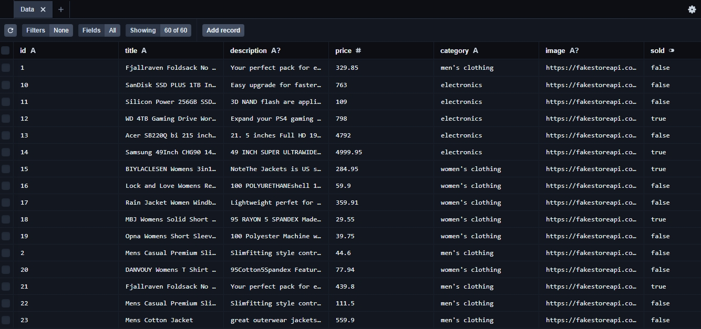

## Roxiler Assingment - Transactions Dashboard

Transactions Dashboard built for Roxiler's assingment. but got errors in fetching the data
But Read the code not too much done for frontend simple frontend .

## Tech Stack

Frontend: React, TypeScript, Tailwind CSS ,recharts
Backend:Express , Typescript , Prisma ORM for database , axios , Neontech database

## API Endpoints

GET /transactions: Fetch transactions (with pagination, search, and filtering).
GET /statistics: Fetch statistics for a selected month.
GET /bar-chart: Fetch data for bar chart visualization.
GET /pie-chart: Fetch data for categories price chart visualization.
GET /combined-data: Fetch data for all endpoints.

## Screenshots

As you see the data is Stored but got some errors in fetching the data

